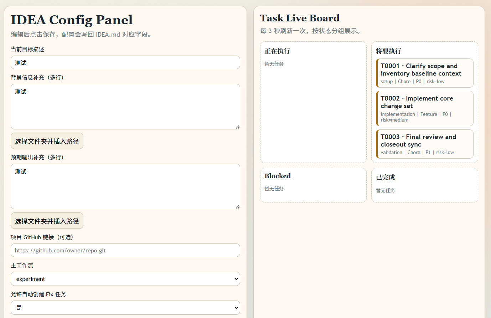
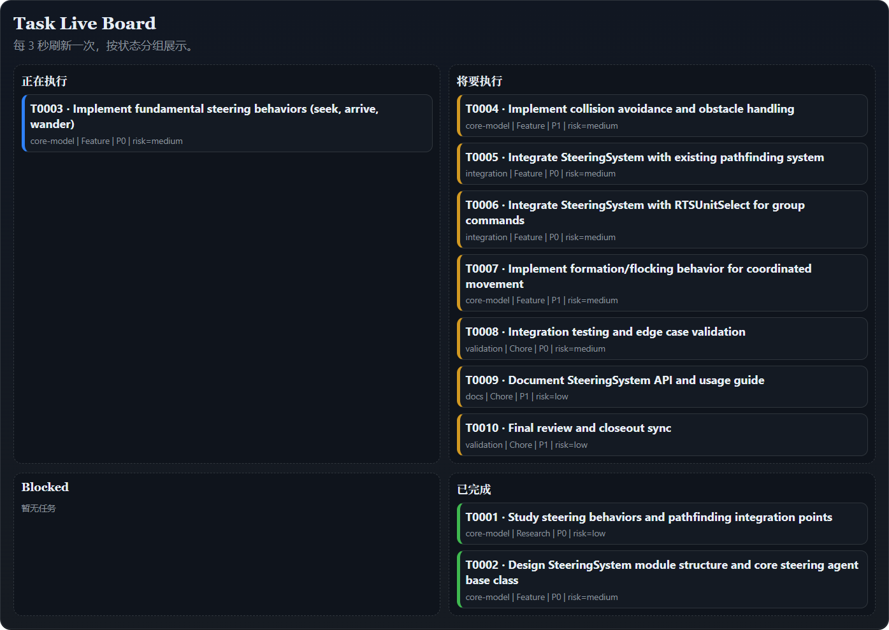

# .agent Template Guide

This folder contains a reusable, project-agnostic Agent workflow.

## Quick Start
1. Write your goal in `IDEA.md`.
2. Ask Agent: "Read IDEA.md, regenerate TASK.md using .agent/TASK_SCHEMA.md, then execute Ralph loop following WORKFLOW.md and COPILOT.md;Note: When you finish your work or encounter issues that need clarification, please invoke the questioning tool to obtain further instructions instead of terminating the conversation directly."
3. Review checkpoints for high-risk tasks.
4. Track results in `.agent/PROGRESS.md`.

## Runtime Feel
- Agent follows Spec -> Plan -> Execute -> Review -> Finish.
- After each step, it syncs `TASK.md`, `PROGRESS.md`, and `state/SESSION_STATE.json`.
- During execution, Agent creates git backup commits before major changes and at key milestones.
- If interrupted, it resumes from state cursor.
- Bugs are converted into `Type=Fix` tasks and tracked in queue.

## File Roles
- `COPILOT.md`: Stable execution policy.
- `TASK.md`: Mutable task queue and status.
- `PROGRESS.md`: Append-only run logs.
- `WORKFLOW.md`: End-to-end loop protocol.
- `TASK_SCHEMA.md`: Task field contract.
- `EXECUTION_CHECKLIST.md`: Operational checklist.
- `skills/SKILL_MAP.md`: Skill dispatch map.
- `state/SESSION_STATE.json`: Resume state.
- `state/LAST_RUN_SUMMARY.md`: Continuation note.

## Other
- The .skills are adapted from https://github.com/wanshuiyin/Auto-claude-code-research-in-sleep. 
- Agent workflows are customizable to suit project needs, and additional languages can be added under the languages directory.

## Optional Git Remote Backup
- Fill `当前项目 GitHub 链接（可选）` in `IDEA.md` if you want Agent to push backup commits to your repository.
- Create local backup commit:
	- `cd web && npm run backup -- --task T0002 --step S2 --message "core change"`
- Push backup commit with IDEA remote:
	- `cd web && npm run backup -- --task T0002 --step S2 --message "core change" --push`

## Web Frontend Quick Guide
1. Enter the web runtime folder:
	- `cd web`
2. Install dependencies:
	- `npm install`
3. Start the local server:
	- `npm start`
4. Open the dashboard:
	- `http://localhost:3077`

What you can do in the page:
- Edit IDEA fields and save directly to `IDEA.md`.
- Fill multiline notes for `背景信息` and `预期输出`.
- Click folder picker buttons to append selected folder relative path text into those multiline notes.
- Track live task cards in `InProgress`, `Todo`, `Blocked`, `Done` lanes.
